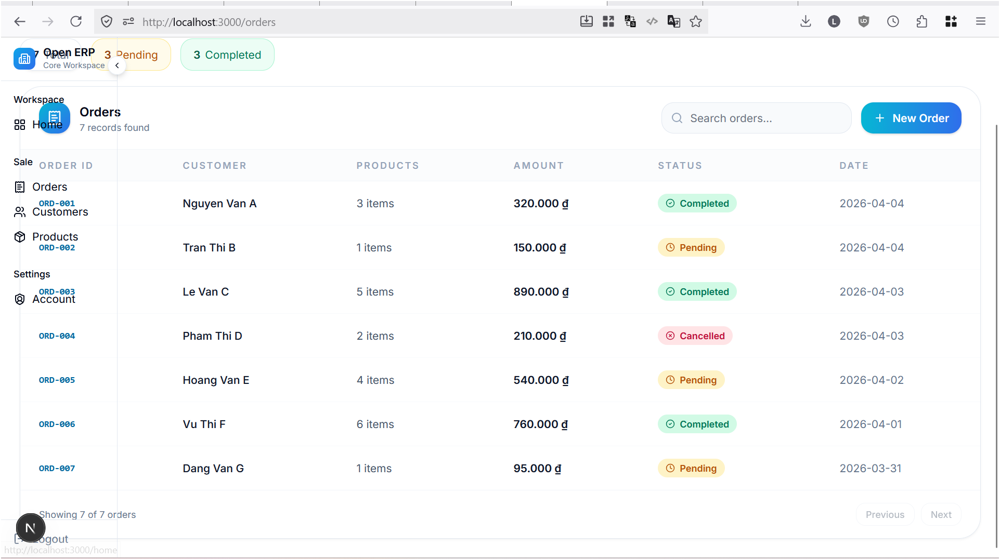
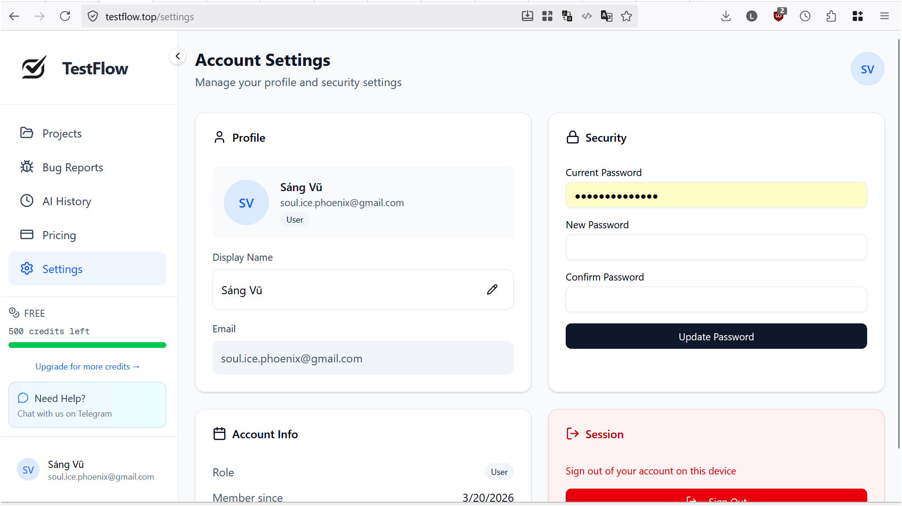

# 0. Concept
FE, BE phát triển độc lập
FE hoàn toàn có thể sử dụng như 1 app local khi chưa có BE

# 1. Yêu cầu theme gọn gàng, đẹp, và dễ sử dụng
Xem thử mẫu:
https://testflow.top/

một số hình ảnh

# 2. Implement Logic Web Layer theo cơ chế độc lập, tách biệt 
- Layer 1 - Route: nhận response từ BE, convert sang Object FE sử dụng
+ Hook 1: 

- Layer 2 - Sử dụng các biến FE để thao tác trên hệ thống như bình thường
// Layer 2 độc lập

- Layer 3 - Call API tới BE để lưu trữ
+ Hook 2

3. Hooks:
- Hook là nơi bật/tắt flag option, khi chưa có BE API thực tế, call Hook sẽ trả về DATA seed từ LocalStorage

